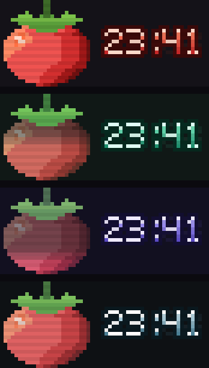

# pixel-pomodoro

[](https://github.com/muhalifalgibran/pixel-pomodoro/actions/workflows/ci.yml)
[](https://github.com/muhalifalgibran/pixel-pomodoro/releases/latest)
[](LICENSE)

A pomodoro timer for the terminal, rendered as actual pixel art. Animated
mascot, truecolor HUD, and progress that persists across sessions.

<p align="center">
  
</p>

Each terminal cell holds **two vertical pixels** — the top pixel is the
foreground of `▀`, the bottom is its background. That doubles the vertical
resolution, which is the difference between pixel art and ASCII art.

```
▛▀▀▀▀▀▀▀▀▀▀▀▀▀▀▀▀▀▀▀▀▀▀▀▀▀▀▀▀▀▀▀▀▀▀▀▀▀▀▀▀▀▀▀▀▀▀▀▀▀▀▀▀▀▀▀▀▀▜
▌ LV.4  ▮▮▮▮▮▮▯▯ 1240xp                         STREAK 7d  ▐
▌            ██                                            ▐
▌       ▄    ██    ▄                                       ▐
▌   ▄▄████▄▄████▄▄████▄▄                                   ▐
▌     ▀██████████████▀                                     ▐
▌   ▄██████████████████▄      ▄▀▀▀▄ ▀▀▀▀▄   ▄ █   █  ▄█    ▐
▌ ▄██████████████████████▄      ▄▄▀  ▄▄▄▀   ▀ █▄▄▄█   █    ▐
▌ ████████████████████████    ▄▀        █   ▄     █   █    ▐
▌ ████████████████████████    ▀▀▀▀▀ ▀▀▀▀    ▀     ▀  ▀▀▀   ▐
▌ ▀██████████████████████▀                                 ▐
▌  ▀████████████████████▀                                  ▐
▌    ▀████████████████▀                                    ▐
▌       ▀▀▀██████▀▀▀                                       ▐
▌  ▰▰▰▰▰▰▰▰▰▰▰▱▱▱▱▱▱▱▱▱  FOCUS  ● ● ● ○  3/4               ▐
▌  ▶ pomo render loop                                      ▐
▙▄▄▄▄▄▄▄▄▄▄▄▄▄▄▄▄▄▄▄▄▄▄▄▄▄▄▄▄▄▄▄▄▄▄▄▄▄▄▄▄▄▄▄▄▄▄▄▄▄▄▄▄▄▄▄▄▄▟
 space pause    e task     / hide
 s skip         t stats
 r reset        q quit
```

That block above is only the silhouette — colour is what the art is actually
made of. Run `pomo -demo` to see it properly.

## Features

- **Faceless pixel-art mascot.** Mood comes from palette and motion, not a
  cartoon face. The tomato breathes, squashes onto its base, and gives off
  steam while you're focused.
- **Time you can see.** The mascot drains as the phase runs down, and the clock
  digits roll over like an odometer.
- **A countdown that escalates.** The last ten seconds shift to amber, glow
  harder, and shake on the beat.
- **Real progress.** XP, level and streak, all derived from your session log.
- **Task labels.** Name what you're working on; it goes in the log.
- **Picks up where you left off.** Quit mid-session and the next launch resumes
  the same phase, clock and task.
- **Three palettes** that cross-fade when the phase changes.

## Requirements

A truecolor terminal (`COLORTERM=truecolor`) at least 60x20. Below that it
falls back to a compact text layout rather than rendering broken art.

Notifications and the completion sound are macOS-only; elsewhere the timer runs
quietly.

## Install

**No Go required.** `pomo` is a single static binary with the art embedded in
it, so a download is all you need.

Grab the archive for your machine from the
[latest release](https://github.com/muhalifalgibran/pixel-pomodoro/releases/latest):

```sh
tar -xzf pomo_*.tar.gz
sudo mv pomo_*/pomo /usr/local/bin/pomo
pomo
```

On macOS, Gatekeeper blocks unsigned downloads the first time. Clear it with:

```sh
xattr -d com.apple.quarantine /usr/local/bin/pomo
```

Verify a download against the published checksums:

```sh
sha256sum -c checksums.txt --ignore-missing
```

<details>
<summary>If you do have Go</summary>

```sh
go install github.com/muhalifalgibran/pixel-pomodoro/cmd/pomo@latest
```

This lands in `$(go env GOPATH)/bin`, so make sure that is on your `PATH`.

Or from a clone:

```sh
git clone https://github.com/muhalifalgibran/pixel-pomodoro
cd pixel-pomodoro
go build -o pomo ./cmd/pomo
```

</details>

## Usage

```sh
pomo                                  # start a 25 minute focus session
pomo --task "write the parser"        # label it
pomo -f 50m -short-break 10m          # your own rhythm
pomo -theme indigo -no-sound          # quieter
pomo -paused                          # set things up before starting
pomo -fresh                           # ignore the saved position, start over
pomo -stats                           # print progress and exit
```

| Key | Action |
| --- | --- |
| `space` | Pause / resume |
| `s` | Skip the current phase |
| `r` | Restart the current phase |
| `e` | Edit the task label |
| `t` | Stats screen |
| `/` | Show or hide the key legend |
| `q` | Quit |

## Configuration

`$XDG_CONFIG_HOME/pomo/config.toml`, falling back to
`~/.config/pomo/config.toml`. Every key is optional; flags override the file.

```toml
focus             = "25m"
short_break       = "5m"
long_break        = "15m"
long_break_every  = 4        # focus sessions per long break
auto_start_breaks = true
auto_start_focus  = false
show_seconds      = true     # false shows MM until the final minute
resume            = true     # pick up where you left off after a quit
scanlines         = true     # the CRT dim on alternate pixel rows
theme             = "ember"  # ember, mint or indigo
notify            = true
sound             = "/System/Library/Sounds/Glass.aiff"
```

## Progress

Finished sessions are appended to `$XDG_DATA_HOME/pomo/sessions.jsonl`
(`~/.local/share/pomo/sessions.jsonl` by default), one JSON object per line:

```json
{"start":"2026-08-16T09:00:00Z","mins":25,"task":"render loop","phase":"focus","done":true}
```

XP, level and streak are **derived by replaying that log** at launch. Nothing
caches them, so the numbers cannot drift out of sync with the sessions that
earned them. (The separate `state.json` described under
[Resuming](#resuming) holds only your place in an unfinished phase — it never
feeds these totals.)

- **XP** — total completed focus minutes. Skipped sessions and breaks earn none.
- **Level** — `floor(sqrt(XP / 25)) + 1`, so levels come quickly at first and
  then stretch out.
- **Streak** — consecutive days with at least one completed focus session. A day
  you haven't started yet doesn't break it.

Editing or deleting lines in the log changes your stats accordingly. That is the
intended way to correct history.

## Resuming

Quitting mid-phase writes your position to `state.json` next to the session
log. The next launch restores the phase, the remaining time, the cycle count
and the task label, and marks the session `↻ resumed`.

A saved position expires after 12 hours. Coming back the next week and landing
mid-phase in a session you have forgotten about is worse than starting clean.
`-fresh` ignores it on demand, and `resume = false` turns it off entirely.

This file is deliberately separate from `sessions.jsonl`. That log is the
append-only record of finished work and the only source of XP, level and
streak; `state.json` is throwaway state for one unfinished phase, and deleting
it costs nothing but your place.

## Editing the art

Sprites are plain text under `assets/sprites/`, one character per pixel plus a
palette. No recompile-and-guess loop: change a pixel, rebuild, run `pomo -demo`.

```
size: 24 24
palette:
  . = transparent
  G = #7cc44a    leaf light
  R = #ef5350    mid bright
  d = #a01818    dark
pixels:
  ...........ss...........
  ......G....ss....G......
  ...
```

A malformed sprite fails at startup with a line number rather than rendering
garbage.

The clock font is a 5x7 bitmap per glyph in `internal/pixfont/glyphs.go`. Four
layers composite on top of it: a dim all-`8`s **ghost** mask behind (the unlit
segments of an LCD), a hue-matched **outline**, a vertical gradient **face**,
and a **bevel** that lights the top edge of every stroke.

> **On vertical offsets:** each cell packs two pixels into one `▀`, so shifting
> a sprite by one pixel re-pairs every cell. In colour this is harmless and is
> exactly how the mascot bobs by half a cell. It only matters for
> `Canvas.Silhouette()`, the mono debug view, which collapses a two-colour cell
> into a single `█` and so looks broken at an odd offset. Static layout still
> lands on even rows to keep those debug renders comparable.

## Development

```sh
go test ./...
```

These flags ship in the binary on purpose. They are what makes a 25-minute timer
debuggable.

| Flag | What it does |
| --- | --- |
| `-demo` | Render the mascot and clock in all three palettes, then exit |
| `-demo -mono` | Opacity silhouettes only, for checking bitmaps |
| `-demo -text 08:05` | Render a specific clock string |
| `-demo -svg out.svg` | Write the art to an SVG (this is how the image above is made) |
| `-tick-scale 60` | Multiply elapsed time; fast-forwards a full cycle into seconds |
| `-skip-to-end` | Start one second from the end of a 1m phase, to verify the completion path |

### Layout

```
cmd/pomo/            flags, config resolution, program start
internal/timer/      the state machine. no clock, no I/O, fully testable
internal/canvas/     pixel buffer, half-block ANSI emitter
internal/pixfont/    5x7 clock glyphs and their four polish layers
internal/sprite/     .pix parser
internal/theme/      per-phase palettes and cross-fading
internal/anim/       fixed-capacity particle pool, easing
internal/store/      session log and the stats derived from it
internal/notify/     macOS notification and sound, stubbed elsewhere
internal/ui/         Bubble Tea model, HUD layout, stats screen
assets/sprites/      the art
```

Two decisions worth knowing about:

**The timer never reads the wall clock.** The UI measures real elapsed time and
feeds it in. Counting ticks would drift, and a suspended laptop hands back one
enormous delta that has to resolve into several phase transitions at once — both
are covered by tests.

**The canvas emits raw SGR with run-length coalescing** rather than going
through a styling library per pixel. Per-cell styling allocates and will not
hold 20fps on a 58x24 pixel band.

## Built with

[Bubble Tea](https://github.com/charmbracelet/bubbletea) ·
[Lip Gloss](https://github.com/charmbracelet/lipgloss) ·
[Harmonica](https://github.com/charmbracelet/harmonica) ·
[BurntSushi/toml](https://github.com/BurntSushi/toml)

## License

MIT — see [LICENSE](LICENSE).
